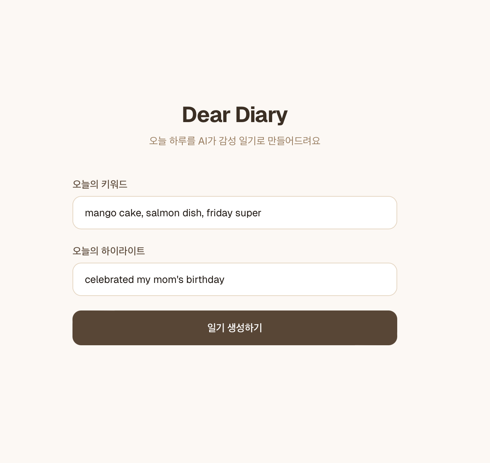
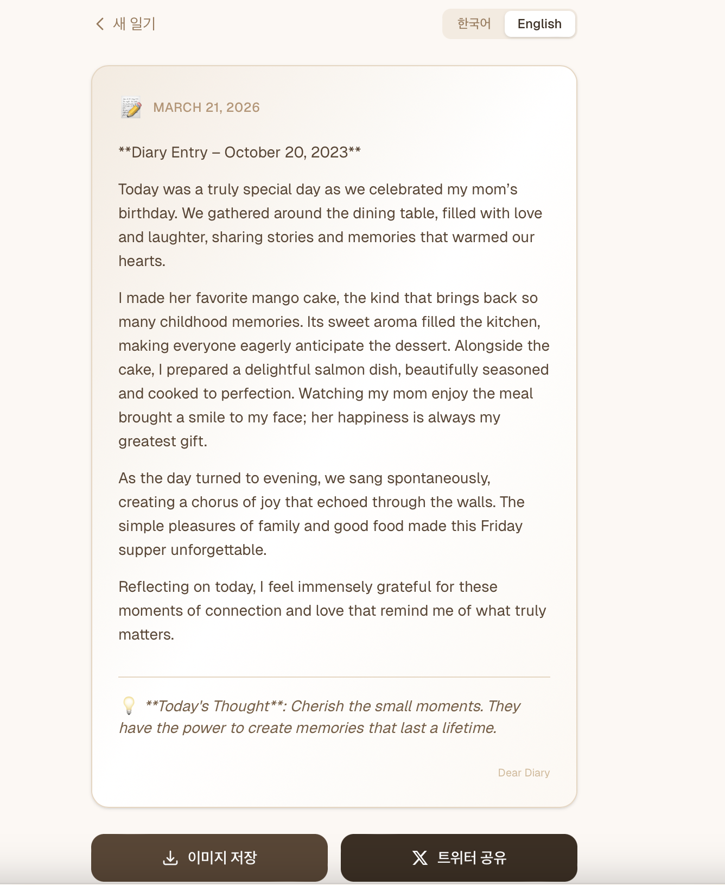
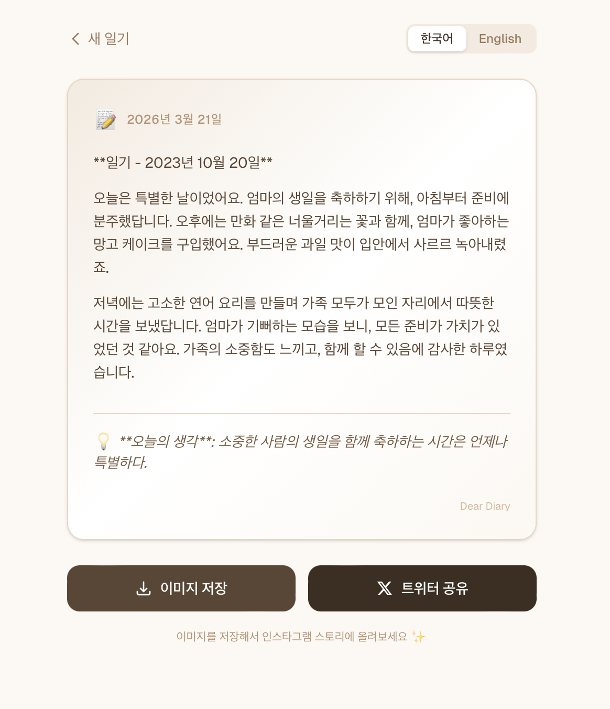

# Dear Diary 📝

> AI가 만들어주는 감성 일기. 키워드와 하이라이트만 입력하면 영어/한국어 일기를 자동 생성하고, SNS에 공유할 수 있습니다.

**Live Demo**: [https://web-seven-alpha-38.vercel.app](https://web-seven-alpha-38.vercel.app)

## Screenshots

| 입력 폼 | 영어 일기 | 한국어 일기 |
|:---:|:---:|:---:|
|  |  |  |

## Features

- **AI 일기 생성** — OpenAI GPT-4o-mini 기반, 키워드와 하이라이트로 감성 일기 자동 작성
- **영어 / 한국어 동시 생성** — 언어별 개별 생성으로 자연스러운 결과
- **이미지 카드 저장** — 일기를 감성 카드 이미지(PNG)로 다운로드
- **SNS 공유** — 트위터 바로 공유, 인스타그램 스토리용 이미지 저장
- **모바일 퍼스트** — 모바일에서 편하게 사용 가능한 반응형 UI

## Tech Stack

| 영역 | 기술 |
|------|------|
| **Frontend** | Next.js 16 (App Router), React 19, TypeScript |
| **Styling** | Tailwind CSS v4 |
| **AI** | OpenAI API (gpt-4o-mini) |
| **Image Export** | html2canvas-pro |
| **Deployment** | Vercel |

## Getting Started

### Prerequisites

- Node.js 20+
- OpenAI API Key ([발급 받기](https://platform.openai.com/api-keys))

### Installation

```bash
cd web
npm install
```

### Environment Variables

```bash
cp .env.example .env.local
```

`.env.local`에 OpenAI API 키를 입력합니다:

```
OPENAI_API_KEY=sk-your-key-here
```

### Run

```bash
npm run dev
```

[http://localhost:3000](http://localhost:3000)에서 확인할 수 있습니다.

## Project Structure

```
web/
├── src/
│   ├── app/
│   │   ├── api/generate/route.ts   # OpenAI 일기 생성 API
│   │   ├── page.tsx                # 메인 입력 폼
│   │   ├── layout.tsx              # 루트 레이아웃
│   │   └── globals.css             # 글로벌 스타일 (warm 팔레트)
│   └── components/
│       └── diary-result.tsx        # 결과 카드 + SNS 공유
├── .env.example
└── package.json
```

## How It Works

1. 사용자가 **키워드**와 **하이라이트**를 입력
2. Next.js API Route에서 OpenAI API를 호출하여 영어/한국어 일기를 **병렬 생성**
3. 결과를 감성 카드 UI로 렌더링
4. **이미지 저장** (인스타그램) 또는 **트위터 공유** 가능

## License

MIT
